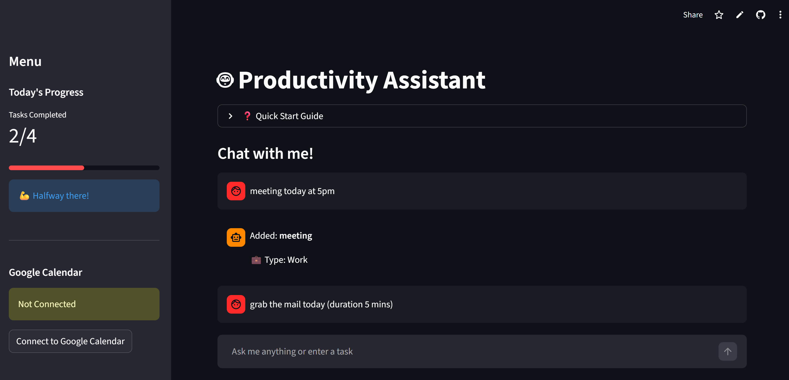
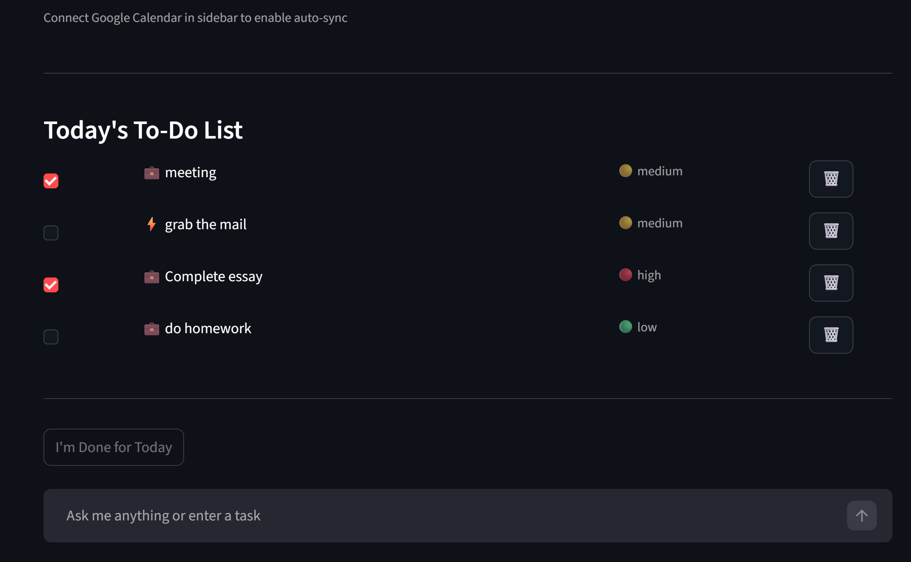
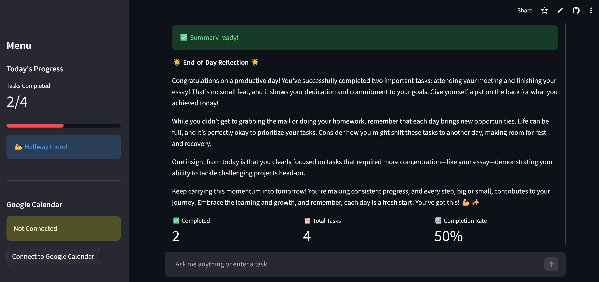

# Productivity Assistant

A smart task management application with natural language processing, workload balancing, and Google Calendar integration. Built with Flask, Streamlit, and OpenAI's GPT models.

## Features

### Natural Language Task Creation
- Add tasks using conversational language (e.g., "Remind me to call John tomorrow at 3pm")
- Automatic parsing of dates, times, priorities, and durations
- Smart categorization into personal, work, or quick tasks

### Google Calendar Integration
- Two-way sync with Google Calendar
- Automatic event creation for scheduled tasks
- View upcoming calendar events directly in the app
- OAuth 2.0 authentication

### Intelligent Workload Balancing
- Monitors daily task load and duration
- Warns when scheduling too many tasks
- Prevents overloading specific days
- Category-based limits (personal, work, quick tasks)

### AI-Powered Chat Assistant
- Supportive productivity coach powered by GPT-4
- Natural conversation for task management
- Smart task matching for deletions
- End-of-day summaries with encouragement

### Task Management
- Create, update, delete, and complete tasks
- Priority levels (low, medium, high)
- Duration estimates
- Task categorization
- Status tracking (todo, in progress, done)

### Screenshots







## Tech Stack

**Backend:**
- Flask (Python web framework)
- OpenAI API (GPT-4 for NLP and chat)
- Google Calendar API
- Flask-CORS

**Frontend:**
- Streamlit (interactive web interface)

**Storage:**
- JSON file-based storage for tasks and credentials

## Project Structure

```
.
├── backend/
│   ├── models/
│   │   ├── task.py              # Task data model
│   │   └── commands.py          # Legacy CLI commands
│   ├── routes/
│   │   ├── tasks.py             # Task API endpoints
│   │   ├── chat.py              # Chat & summary endpoints
│   │   └── calendar.py          # Google Calendar endpoints
│   ├── services/
│   │   ├── tasks_service.py     # Task CRUD operations
│   │   ├── nlp_parser_service.py # Natural language parsing
│   │   ├── openai_service.py    # OpenAI chat interface
│   │   ├── balancer_service.py  # Workload balancing logic
│   │   └── calendar_services.py # Google Calendar integration
│   ├── app.py                   # Flask application factory
│   └── config.py                # Configuration management
├── streamlit_app.py             # Streamlit frontend
├── data/
│   ├── tasks.json               # Task storage
│   └── credentials.json         # Google OAuth tokens
└── .env                         # Environment variables
```

## Installation

### Prerequisites
- Python 3.8+
- OpenAI API key
- Google Cloud Project with Calendar API enabled

### Setup

1. **Clone the repository**
```bash
git clone <repository-url>
cd productivity-assistant
```

2. **Install dependencies**
```bash
pip install -r requirements.txt
```

3. **Set up environment variables**

Create a `.env` file in the root directory:
```env
KEY=your_openai_api_key
GOOGLE_CLIENT_ID=your_google_client_id
GOOGLE_CLIENT_SECRET=your_google_client_secret
GOOGLE_REDIRECT_URI=http://localhost:5000/api/calendar/callback
SECRET_KEY=your_secret_key
```

4. **Configure Google Calendar API**
- Go to [Google Cloud Console](https://console.cloud.google.com/)
- Create a new project or select existing one
- Enable Google Calendar API
- Create OAuth 2.0 credentials (Web application)
- Add `http://localhost:5000/api/calendar/callback` to authorized redirect URIs
- Download credentials and add to `.env`

5. **Create data directory**
```bash
mkdir data
```

## Usage

### Starting the Application

1. **Start the Flask backend** (in one terminal):
```bash
python backend/app.py
```
The API will run on `http://localhost:5000`

2. **Start the Streamlit frontend** (in another terminal):
```bash
streamlit run streamlit_app.py
```
The app will open in your browser at `http://localhost:8501`

### Using the App

**Adding Tasks:**
- Type naturally in the chat: "Buy groceries tomorrow at 5pm"
- The AI will parse date, time, priority, and duration automatically
- Enable "Auto-sync to Google Calendar" to create calendar events

**Managing Tasks:**
- Check boxes to mark tasks complete
- Click 🗑️ to delete individual tasks
- Use natural language: "delete the grocery task" or "remove tomorrow's meeting"

**Google Calendar:**
- Click "Connect to Google Calendar" in the sidebar
- Authorize the app
- Tasks with dates/times will sync automatically if enabled

**End of Day:**
- Click "I'm Done for Today" to get an AI-generated summary
- Receive encouragement and productivity insights

## API Endpoints

### Tasks
- `GET /api/tasks/` - Get all tasks
- `POST /api/tasks/` - Create task from natural language
- `PUT /api/tasks/<task_id>` - Update task
- `DELETE /api/tasks/<task_id>` - Delete task

### Chat
- `POST /api/chat/message` - Send message to AI assistant
- `GET /api/chat/daily-summary` - Get end-of-day summary
- `POST /api/chat/match-task` - Match user input to task for deletion

### Calendar
- `GET /api/calendar/auth` - Get Google OAuth URL
- `GET /api/calendar/callback` - OAuth callback handler
- `GET /api/calendar/status` - Check authentication status
- `GET /api/calendar/events` - Get upcoming events
- `POST /api/calendar/sync-task/<task_id>` - Sync specific task to calendar

## Configuration

### Workload Limits
Customize in `backend/services/balancer_service.py`:
```python
DAILY_LIMITS = {
    'personal': 3,
    'work': 3,
    'quick': 5
}
RECOMMENDED_DAILY_MINS = 480  # 8 hours
MAX_MINS = 600  # 10 hours
```

### Task Categories
- **Personal**: Errands, self-care, hobbies
- **Work**: Job tasks, meetings, assignments
- **Quick**: Tasks under 10 minutes

### Priority Levels
- **High**: Urgent, ASAP, important keywords
- **Medium**: Default priority
- **Low**: Nice-to-have tasks


## Troubleshooting

**"Not authenticated" error:**
- Make sure you've connected to Google Calendar in the sidebar
- Check that redirect URI matches in Google Console and `.env`

**Tasks not syncing to calendar:**
- Ensure the task has a due date
- Enable "Auto-sync to Google Calendar" checkbox
- Verify Google Calendar authentication

**OpenAI API errors:**
- Check that your API key is valid in `.env`
- Ensure you have sufficient API credits
- Verify network connectivity


## Acknowledgments

- OpenAI for GPT models
- Google Calendar API
- Streamlit for the amazing frontend framework
- Flask for the robust backend framework
